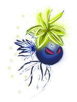

# PLASTIC TERROR

October MiniGameJam 2018 - Berlin
A javascript game for fun designed and developed within a couple of hour.

### The story
This Jam session was: underwater, futuristic animals

### How to play
Download the code and just open the index.html on your Desktop.  

### Compatibility
Desktop: Chrome, Safari, Firefox

### Libs
Kontra.js  
https://straker.github.io/kontra/

### Authors
Asisa, Pierre and Alioune  

### Our game story
What happens when more plastic will fill the ocean?
Cells will turn into bigger and bigger monsters.

We accomplished to start the first transition.

### License
This project is licensed under the MIT License - see the LICENSE.txt file for details

### Acknowledgment

Thank you so much to the Mini Game Jam!
http://berlinminijam.de/
